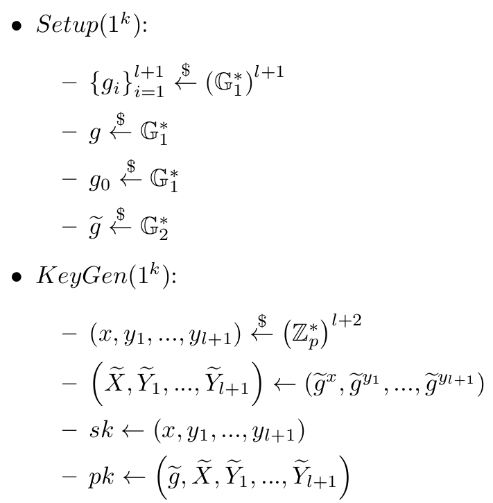

Threshold Blind Pointcheval-Sanders proof of knowledge of signature
--------------------------------------------------------------------

The signature scheme by Pointcheval and Sanders [0] allows a prover to prove in zero-knowledge to a verifier that it knows a signature from a signer.

The scheme also lets the prover blind the message sent to the signer, such that the signer cannot see the message it signs. 
The signature can be then un-blinded by the prover to yield a witness that it later uses to prove knowledge of a signature from the signer.

The work of Coconut [1] shows a scheme (Appendix B) based on the scheme by Pointcheval and Sanders where the signer is decentralized, making the signature scheme into a threshold signature scheme.
The threshold signature scheme has an interactive DKG phase, but the actual signing is non-interactive, and signatures can be easily aggregated.

Both schemes [0] and [1] rely on an interactive assumption (Attacker is given signing oracle access, etc.). However, a more recent work [2] of Pointcheval and Sanders shows how a simple modification to their scheme makes it rely on (q-SDH)-like assumptions which are non-interactive.  

The work of [3] mentions the modification of [2] but does not incorporate it to the formulas.

This package implements the threshold version of the blind signature and zero-knowledge proof of knowledge of signature [1],
with the modification of [2] which [3] mentions but does not give an overview of.

For future maintainability, the formulas are shown below, in the same notation as they appear in the code, which follows the notation of C.3 from [3].

[0] Short Randomizable Signatures; David Pointcheval and Olivier Sanders; https://eprint.iacr.org/2015/525

[1] Coconut: Threshold Issuance Selective Disclosure Credentials with Applications to Distributed Ledgers; Alberto Sonnino, Mustafa Al-Bassam, Shehar Bano, Sarah Meiklejohn and George Danezis; https://arxiv.org/abs/1802.07344

[2] Reassessing Security of Randomizable Signatures; David Pointcheval and Olivier Sanders; https://eprint.iacr.org/2017/1197

[3] Privacy-preserving auditable token payments in a permissioned blockchain system;  Elli Androulaki, Jan Camenisch, Angelo De Caro, Maria Dubovitskaya, Kaoutar Elkhiyaoui, and Björn Tackmann; https://eprint.iacr.org/2019/1058 

-----------------------------------------------
The implementation uses the Mathlib [4] library for group and field operations:

For ease of understanding, the formulas below show the non-threshold version, as the threshold-ized version is shown later on.

`l` is the length of the message signed, and the scheme works on `l+1` sized vectors due to the modification of [2].

When a message is blinded, `m'` is generated according to the modification of [2].
The blinding is essentially an ElGamal encryption of a one time public key `u`,
along with a NIZK `ξ` which is computed as below.

Notice that in the NIZK description I set `l` to be the length
of the vector, but actually the `m'` element (indexed `l+1`) is included in the witness
when the NIZK is produced.

(of course, in the code, `e` is computed via the random oracle)

To sign a blinded message, each signer does the following:

As can be seen above, un-blinding the message is simply decrypting with the private key `z` of `u`,
and checking validity of the witness `h'`.

When proving knowledge of `h'`, the NIZK `ψ` is computed as follows:

(of course, in the code, `e` is computed via the random oracle)

[4] https://github.com/IBM/mathlib

